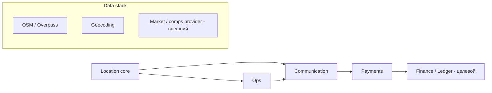

# Roadmap доведения ключевых модулей до ~90%

Принципы: только **конкретные workstreams** с зависимостями; слои не смешиваются; «90%» = decision-grade **в рамках текущего data stack** где это возможно.

---

## Зависимости между модулями (высокий уровень)

- **Location core** усиливает standalone-отчёты и любые сценарии «где объект» в comm/ops.
- **Communication** уже интегрирует **Payments** и **Ops**; unified orchestration должна опираться на эту связку, а не дублировать.
- **Pricing/Revenue** без **внешнего market layer** упирается в потолок — параллельно с локацией, но не блокер для comm core.
- **Finance/Ledger** зависит от стабильных **payment events** и модели начислений — позже comm/payments стабилизации.

---

## 1. Location / Residential

**Раньше:** расширить control set + инварианты отсутствия данных.  
**Параллельно:** UI дисклеймеры в standalone.  
**Блокеры данных:** полнота OSM по регионам; качество геокодинга.  
**Блокеры реализации:** формализация pass/fail после tuning.

| # | Workstream | Результат ~90% | Acceptance (кратко) |
|---|------------|----------------|---------------------|
| R1 | **Residential control set v1** (фиксированные адреса + эталонные диапазоны score/drivers) | Core ~88% | Прогон в CI; регресс = необъяснимое изменение > порога на ≥1 эталоне без явного changelog конфига. |
| R2 | **Unknown / sparse OSM path** | Core | Если элементов < N или geocode low confidence → секция «данных мало» + снижение уверенности в headline. |
| R3 | **Согласование standalone с core** | Standalone | Каждое число в отчёте имеет provenance: measured / model / proxy. |
| R4 | **Heatmap / magnets QA** | Core+Demo | Визуальные аномалии на control set документированы или исправлены. |
| R5 | **Provider failover metrics** | Ops | Таймаут Overpass/геокодера → деградация с кодом причины в meta отчёта. |
| R6 | **Документ ограничений по странам/городам** | Docs/product | Список известных bias и «не использовать для X». |

---

## 2. Location / Commercial-Retail

**Раньше:** spatial truth layer (минимальный viable geometry), иначе format-fit остаётся «текстом без земли».  
**Параллельно:** расширение validation scripts (`scripts/commercial-*`).  
**Блокеры данных:** footfall, реальные коридоры — частично только через proxy или внешние поставщики.  
**Блокеры реализации:** геометрия, граф пешеходности, barrier masks.

| # | Workstream | Результат ~90% | Acceptance |
|---|------------|----------------|------------|
| C1 | **Micro-catchment v1** (радиусы + веса по сети улиц **или** simplified isochrone stub с явным tier) | Core | На control polygons коридор «не через стену»; в отчёте поле `spatial_tier: stub|graph|provider`. |
| C2 | **Barrier layer v1** (вода, крупные автодороги, ж/д по OSM) | Core | Магниты за барьером не вклад в catchment без штрафа; тесты на 3–5 синтетических layout. |
| C3 | **Corridor logic** (осевая линия улицы + snap subject) | Core | Subject привязан к ближайшему осмысленному сегменту; расстояния вдоль коридора vs евклидово — документировано. |
| C4 | **Format-fit ↔ spatial consistency** | Standalone | Если spatial_tier=stub, вердикты помечены как `pilot`; несовпадение запрещено молча. |
| C5 | **Commercial control set + golden JSON** | Validation | Аналог `scripts/commercial-format-fit-validation.ts` с порогами; fail = регресс по ≥2 метрикам. |
| C6 | **UI: карта уровня достоверности** | Demo+Standalone | Легенда: что нарисовано из OSM, что интерполяция. |
| C7 | **Optional external footfall provider hook** | Integration | Интерфейс `FootfallProvider`; без ключа — явный proxy tier. |

---

## 3. Communication

**Раньше:** убрать двусмысленность mock vs prod knowledge; расширить regression на RU pipeline.  
**Параллельно:** observability / audit completeness.  
**Блокеры данных:** качество резерваций в подключённых системах.  
**Блокеры реализации:** мало.

| # | Workstream | Acceptance |
|---|------------|------------|
| K1 | **Knowledge source matrix** | В prod нет тихого `PROPERTY_DB` без флага; все ответы с `source` в audit. |
| K2 | **Reservation ambiguity suite** | Фиксированные кейсы matched/ambiguous/unmatched в тестах + метрики эскалаций. |
| K3 | **LLM off deterministic parity** | Сравнение маршрутов с/без ключа на control set — безопасные исходы идентичны по классу. |
| K4 | **Payment trigger safety** | Нет авто-инвойса при `reservation.status !== matched` (инварианты в тестах). |
| K5 | **SLO hooks** | Таймауты на внешние вызовы в orchestrator с измерением в audit record. |

---

## 4. Pricing / Revenue

**Раньше:** внешний market data adapter (хотя бы один провайдер) + явный proxy mode.  
**Параллельно:** отвязка revenue цифр от `generator.ts` в sellable.  
**Блокеры данных:** **главный** — отсутствие провайдера рыночных ставок/компов.  
**Блокеры реализации:** контракт нормализации единиц (валюта, ночь vs месяц).

| # | Workstream | Acceptance |
|---|------------|------------|
| P1 | **MarketProvider interface** | Реализация `noop|stub|providerX`; отчёт не смешивает stub с live. |
| P2 | **Revenue band = confidence interval** | Любая цифра дохода с диапазоном и N. |
| P3 | **Отделить demo generator от standalone** | Sellable не импортирует детерминированный hash-based revenue. |

---

## 5. Ops / Autonomy

**Раньше:** связать инциденты с реальными жизненными циклами (статусы юнита).  
**Параллельно:** расширение incident-test-harness.  
**Блокеры данных:** история инцидентов по гостю/объекту.  
**Блокеры реализации:** калибровка порогов.

| # | Workstream | Acceptance |
|---|------------|------------|
| O1 | **Incident control set** | 20+ типовых кейсов с ожидаемым `OpsDecisionResult`. |
| O2 | **Check-in gate ↔ comm** | Единая таблица причин блокировки; дублирования политик нет. |
| O3 | **Task lifecycle metrics** | Создание/закрытие задачи логируется; idempotency на create. |

---

## 6. Finance / Ledger

**Раньше:** события из payments → неизменяемый журнал; double-entry модель.  
**Параллельно:** ничего «красивого» в UI без журнала.  
**Блокеры данных:** налоговые правила юрисдикций (внешние).  
**Блокеры реализации:** миграции схемы, идемпотентность webhooks.

| # | Workstream | Acceptance |
|---|------------|------------|
| F1 | **Ledger domain model** | Сущности Account, Entry, Journal; без UI. |
| F2 | **Payment event mapping** | Каждый webhook создаёт ровно один journal или идемпотентный skip. |
| F3 | **Reconciliation export** | CSV/JSON для бухгалтерии; checksum run. |

---

## 7. Cross-module decision engine / orchestration

**Раньше:** единый контракт «решение платформы» (типы + версия), без переписывания comm.  
**Параллельно:** адаптеры модулей.  
**Блокеры данных:** те же, что у доменных модулей.  
**Блокеры реализации:** согласование двух decision-engine.

| # | Workstream | Acceptance |
|---|------------|------------|
| X1 | **`PlatformDecision` schema v0** | JSON-schema или zod; поля: module, confidence, limitations[], actions[]. |
| X2 | **Adapter: comm → platform** | Маппинг исходов orchestrator в `PlatformDecision`. |
| X3 | **Adapter: location report → platform** | Только standalone meta + spatial_tier; без выдуманных денег. |
| X4 | **Policy: кто авторитетен при конфликте** | Таблица приоритетов (например safety > payment > location upsell). |

---

## Главный bottleneck (перепроверено)

См. явный вывод в `docs/platform-90-percent-readiness-summary.md`. На момент аудита: **Location / Commercial-Retail core (spatial layer)** — наибольший разрыв между ожидаемой decision-grade геометрией и текущей радиальной/OSM-point моделью; плюс он **разблокирует** честную sellable позицию commercial standalone.
